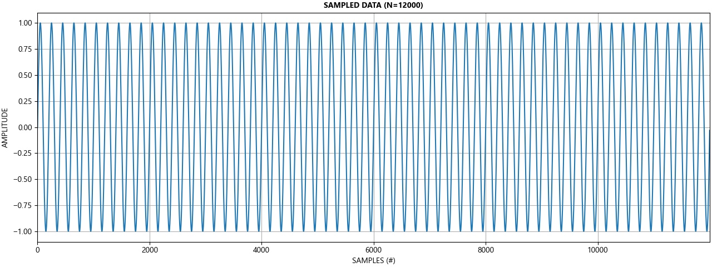
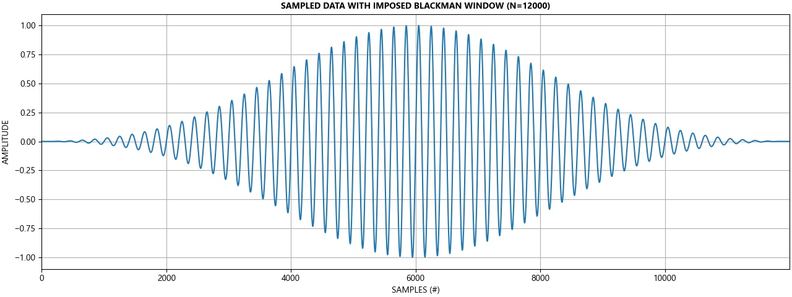

STEPS FOR CALCULATING DISTORTION:
=================================

A. Time Series Data
-------------------

Time series data is retrieved by the Fluke 8588A digitizer. The
digitizer has a fixed sampling frequency of **5MHz**, which depending on
the frequency of interest, could be considered excessive and drive up
the number of samples required to appropriately window the time series
data. Consequently, specifying an aperture length is a way of setting an
equivalent sampling frequency lower than 5MHz. The aperture is the
duration after each trigger where samples at a rate of 5 MHz are
averaged together.

 Calculating the appropriate sample length, sampling frequency, and the
aperture length requires some understanding of windowing that will be
discussed in **Sections B and E** in greater detail.

First the sampling frequency, Fs, is computed by selecting a frequency
100x larger than the fundamental (or frequency of interest). Note, an Fs
of at least 10x larger than the frequency of interest tends to be a
general rule of thumb. If the computed Fs is not equal to or larger than
twice the specificed bandwidth for the given measurement, then twice the
measurement bandwidth is chosen by default. However, this value of Fs
may not be its final value since we still need to have an integer number
of samples averaged per measurement by the digitizer to resolve this
sampling frequency. Consequently, the sampling frequency is calculated
twice: once more after calculating an integer number of samples to
average by the digitizer.

1.  **\_Fs** = max( (2 \* bw), (100 \* F0) )
2.  **samples\_to\_average** = int( 5MHz / \_Fs )= **25**
3.  **Fs** = 5MHz / samples\_to\_average = **200kHz**

Next, the sample length, **N**, is computed by finding the window length
of the measurement. An error is expressed since the main lobe width is
directly proportional to the number of cycles captured. The minimum
value of **N** correlates to the lowest detectable frequency by the
windowing function. For instance, blackman requires a minimum of 6
period cycles of the frequency of interest in order to express content
of that lobe in the DFT. Sampling frequency does not play a role in the
width of the lobe, only the resolution of the lobe.

In this example, an error of 10% is specified. For a 1kHz fundamental,
the main lobe width will maximally be 100Hz, the lowest detectable
frequency, **ldf**.

1.  **error** = 10%
2.  **ldf** = f0 \* error = **100Hz**
3.  **N** = int(6 \* (fs / ldf)) = **12,000 samples**

Finally, the aperture is calculated. For this discussion, however, this
won't be covered. Please review **Section F** to better understand how
to compute the aperture provided the sampling frequency, Fs.

1.  **aperture** = max(200e-9 \* (samples\_to\_average - 1), 0) =
    **4.8us**

B. Windowing to reduce spectral leakage of non-integer periods
--------------------------------------------------------------

The FFT of discrete time series data (DFT) requires an integer number of
cycles, otherwise, spectral leakage occurs in the form of additional
artificial spectral content. Since an FFT assumes an infinite data
series capable of looping back on itself, a non integer number of cycles
(periods) creates a discontinuity between the first and last sample and
so false harmonics are observed.

A windowing function aims to mitigate the spectral error associated with
data discontinuity by tapering the head and tail of the data series to
attenuate the effect of the disconinuity. In this example, a blackman
window was selected since it has greater side lobe attenuation at the
cost of wider main lobe width. However, the main lobe width is equal to
6/N. That is, at least 6 cycles of the frequency of interest is required
to resolve at least the frequency of interest and nothing lower. By
increasing the sample length, additional cycles are captured, which help
reduce the main lobe error width. Additional information on windowing
can be found in section E further down on this page. \

Increasing the length of M for a given sampling frequency reduces the
width of the main lobe. In other words, in situations where zero padding
is not involved and M=N, the main lobe width is reduced by increasing
the number of samples for a given sampling frequency.

The time series data is then multiplied by the window (or convolved in
the frequency domain). Tapering at the head and tail of the time series
data is observed.

C. The FFT
----------

The FFT of the time series data with windowing applied is presented
below. The fundamental at 1kHz and two odd order harmonics are resolved
by the FFT. Note the maximum frequency of the FFT is half the sampling
frequency of 200kHz as per Nyquist's sampling theorem. While the FFT
resolves spectral content greater than 100kHz, the values are simply the
complex conjugate of the postive spectral components. Consequently, this
data is truncated from the plot; otherwise, the complex conjugate pairs
are identical along the real axis besides mirrored across 100kHz.

A total rms measurement is computed from the FFT data to later be used
computing the THD+N.

As per Parseval's theorem:

**total\_rms** = np.sqrt(np.sum(np.abs(yf / N) \*\* 2))

To reject the fundamental frequency, the local minimas centered about
the fundamental frequency are lcoated and values within these bounds are
thrown out. This is more or less a crude attempt at notch rejection. A
more appropriate method would be to calculate the main lobe width and
reject within this bandwidth.

A noise rms measurement is computed from the FFT data to later be used
computing the THD+N.

Again, as per Parseval's theorem:
**noise\_rms** = np.sqrt(np.sum(np.abs(\_yf / N) \*\* 2))

 **THDN** = noise\_rms / total\_rms

D. Characterizing an FFT
------------------------

E. More on Windowing
--------------------

The two characteristics that define a window in the time domain are the
window length and shape. The two most relevant window characteristics in
the frequency domain are the mainlobe width and the sidelobe height. The
relationships between window length, mainlobe width, and sidelobe height
are summarized in the following table for a number of commonly used
window shapes.

M is the number of samples captured for a measurement of time series
data. M refers to the length of the windowing filter applied to the. M≤N
where N samples refers to the length of the FFT. When N is greater than
M, zero padding is employed, which does not introduce new data to the
FFT, but only increases the resolution of the FFT.

The effective data length of captured period cycles are equal within
this table. This means that a minimum of 6 cycles must be obtained to
adequately use the blackman window to have the equivalent data length of
a Hanning or Hamming window where only 4 cycles must be obtained.

-   A longer window results in a narrower main lobe.
-   A longer window improves the frequency resolution.

  | Window Shape                          | Relative Peak Side Lobe Magnitude   | Approx. Main Lobe Width (Hz)
  | ------------------------------------- | ----------------------------------- | ------------------------------
  | Rectangular/boxcar                    | -13 dB                              | 2/M
  | Bartlett (triangle)                   | -26 dB                              | 4/M
  | Hanning (raised cosine)               | -31 dB                              | 4/M
  | Hamming (raised cosine on pedestal)   | -42 dB                              | 4/M
  | Blackman                              | -58 dB                              | 6/M

F: Fluke 8588A Aperture Parameters
----------------------------------

The aperture is the duration after each trigger where samples at a rate
of 5 MHz are averaged together.

The aperture can be set from 0 ns to 3 ms in 200 ns increments up to 1
ms, and 100 μs increments from 1 ms to 3 ms.

Since the minimum duration to trigger one sample is 200ns, an aperture
length greater than 0 ns allows more than one sample to be captured and
averaged by the digitizer. In a sense, increasing the aperture lowers
the sampling frequency of the digitizer."

The entire process for one reading is 200 ns, which gives a maximum
trigger rate of 5 MHz. The aperture can be set from 0 ns to 3 ms in 200
ns increments up to 1 ms, and 100 μs increments from 1 ms to 3 ms.
Greater aperture length decreases sample rate.

  | Aperture   | Time            | Samples Averaged (\#)   | Fs
  | ---------- | --------------- | ----------------------- | ------------
  | 0ns        | 200ns           | 1                       |  5 MHz
  | 200ns      | 200ns + 200ns   | 2                       |  2.5 MHz
  | 400ns      | 400ns + 200ns   | 3                       |  1.6667 MHz
  | 600ns      | 600ns + 200ns   | 4                       |  1.25 MHz
  | 800ns      | 800ns + 200ns   | 5                       |  833.33 kHz
  | 1us        | 1us + 0.2us     | 6                       |  833.33 kHz

